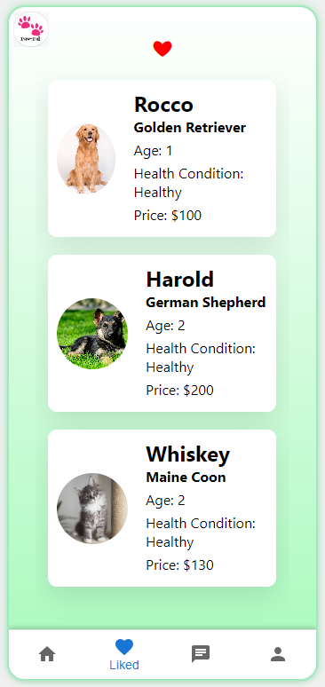

# PawPal: Mobile Pet Marketplace App

## Overview

<p align="center">
  
</p>

PawPal is a mobile application designed for the buying and selling of pets, offering a platform for users to connect, share, and engage with a community of pet lovers. This project demonstrates proficiency in mobile app development, real-time database integration, and user interface design.

## Key Features

- **User Authentication**: Implements secure login and sign-up functionalities.
- **Pet Browsing**: Allows users to browse, like, or dislike pet profiles.
- **Favorites List**: Users can track and manage their liked pets.
- **Profile Management**: Users can view and edit their profiles, with real-time database updates.
- **Pet Management**: Functionality for users to add new pets to the platform and view their own pet listings.

### Future Enhancements

- **Advanced Pet Filtering**: Plans to introduce filters for age, price, and location.
- **Real-Time Chat**: Aiming to develop a fully functional chat feature.
- **Media Queries**: Implement media queries to apply CSS styles for different sized devices. 

## Technical Stack

- **Frontend**: Developed with React, HTML, CSS.
- **Backend**: Utilizes Firebase for data storage and real-time updates (API keys are excluded from this repository).

## Installation

1. Clone the repository:
   ```sh
   git clone https://github.com/your_username/PawPal.git

2. Install dependencies:
   ```sh
   npm install
## Firebase Setup

To run this project with Firebase:

1. **Create a Firebase Project**: Visit [Firebase Console](https://console.firebase.google.com/), sign in with your Google account, and create a new project.
2. **Configure Authentication**: In the Firebase console, set up the authentication method you prefer.
3. **Set Up Firestore Database**: In the Firebase console, create a Firestore database one for users and one for pets. Check the screenshots to know what data to store about both users and pets.
4. **Configure Firebase in App**:
    - In your Firebase project, find your web app's Firebase configuration object.
    - Create a `.env` file in your project root and add your Firebase config keys here.
5. **Run the App**: Use `npm start` to run the app. It should now be connected to your Firebase project.

## Usage

After installation and Firebase setup, users can register or log in, browse pet listings, manage their profiles, and add new pet listings.

### Screenshots

<p align="center">
  Login Screen<br>
  
</p>

<p align="center">
  Signup Screen<br>
  
</p>

<p align="center">
  Liked Screen<br>
  
</p>

<p align="center">
  Chat Screen<br>
  
</p>

<p align="center">
  Profile Screen<br>
  
</p>

